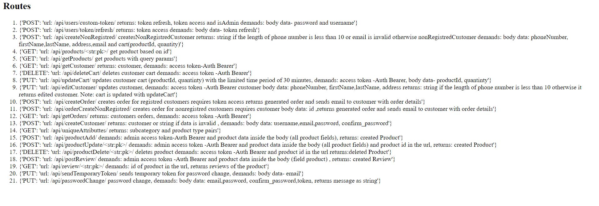

# API for EfashionAngular
 

# Skill set
Django, Python, HTML

# Installation
* 1 - clone repo 
* 2 - create a virtual environment and activate
* 3 - cd into project "efashionshop"
* 4 - pip install -r requirements.txt
* 5 - python manage.py runserver